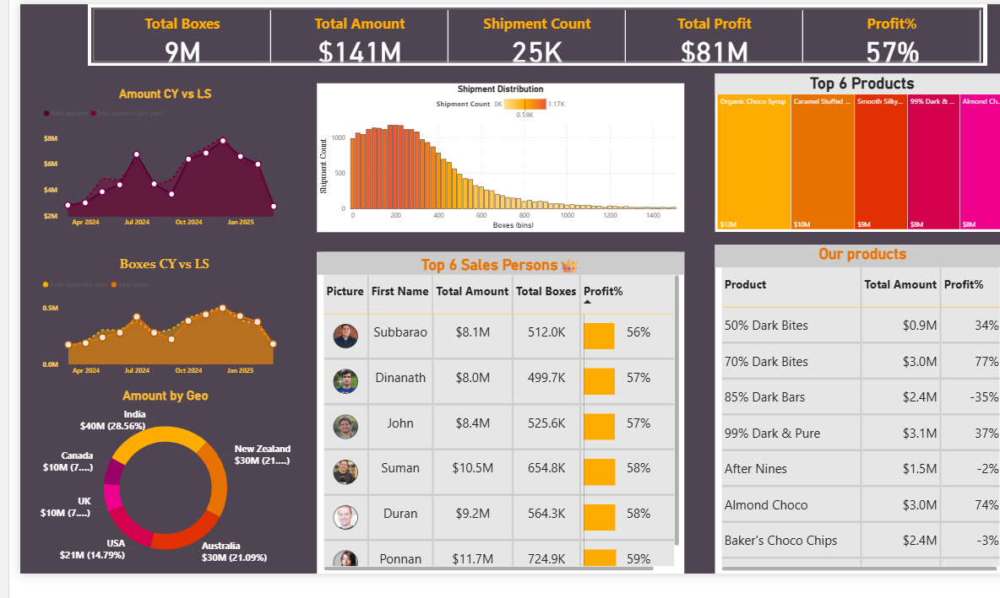

# 🍫 Chocolate Company Sales Dashboard – Power BI

### 📊 Overview
This Power BI project visualizes sales performance for a chocolate company.
It provides insights into yearly and monthly sales trends, top-selling products, and top 6 employees based on sales.

### 🎯 Objectives
- Analyze total sales by year and month
- Identify top 6 employees
- Find top-selling chocolate products
- Visualize KPIs such as total sales and profit

### 🧰 Tools Used
- Power BI Desktop  
- Excel (data source)  
- DAX functions for measures

### 📷 Dashboard Preview

### 📈 Insights
- Highest sales observed during festive months  
- Top-performing product: Truffle Deluxe  
- Consistent performance improvement over time

---

### 🧑‍💻 Author
**Uma**  
📍 Seychelles  
💼 https://umaswathi555.github.io/uma-port/
